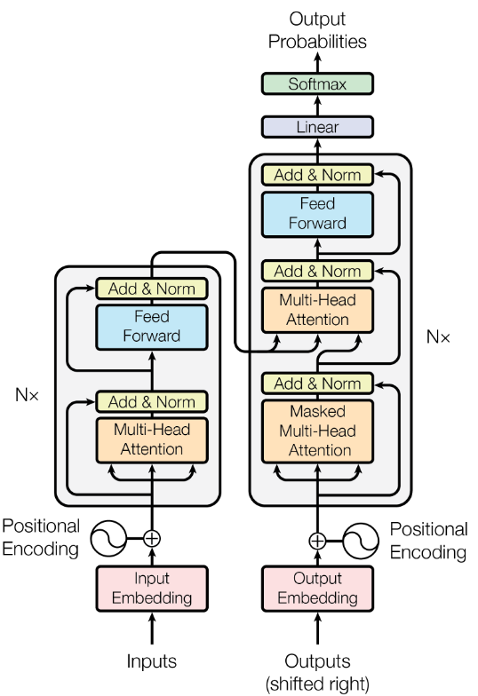

# GPT-2: From scratch to TinyStories
This repo contains the training code and commits for building a GPT-2 transformer from scratch in PyTorch, making speed and memory optimizations, training a custom tokenizer (and discussing it's mechanics), further tuning the model parameters to work best for TinyStories training on two 3090s, and finally generating stories from the trained model.  The details can be found [here](https://dpopovvelasco.dev/posts.html).
transformer_orig.png

	
	
<em>Transformer Diagram, Source: Attention Is All You Need by Vaswani et al.</em>

